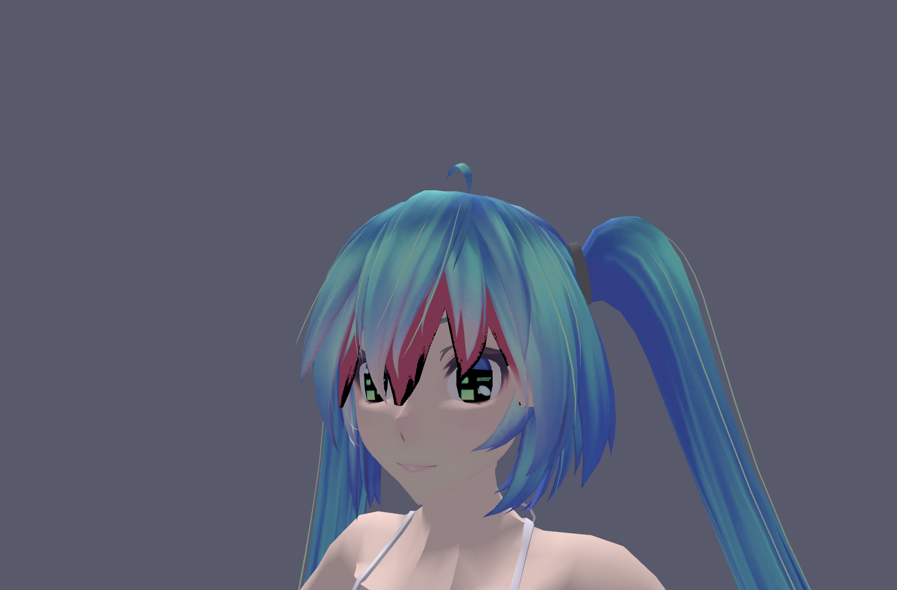
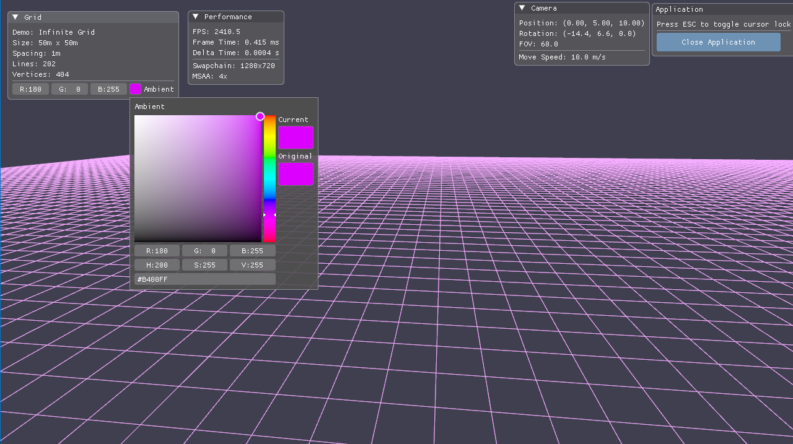
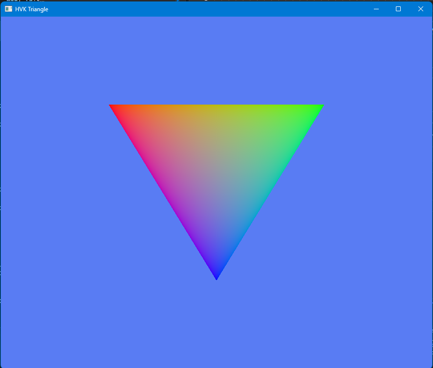

# Holy Vulkan Engine

A modern Vulkan-based 3D rendering engine built with C++20, featuring an Entity Component System (ECS) architecture that makes graphics programming accessible without sacrificing performance.

> "I am working on something holy. You are a bunch of squirrels." — In memory of Terry A. Davis

## Overview

Holy Vulkan Engine (HVK) provides a clean, batteries-included abstraction layer over Vulkan 1.3, combining modern graphics APIs with game-engine-style ECS architecture. The engine features automatic resource management, GLTF model loading with PBR materials, hierarchical scene graphs, and an intuitive spawning API that gets you rendering in minutes.


*GLTF model rendering with PBR materials, multi-light setup, and MSAA*


*Infinite grid visualization with Dear ImGui integration*


*Getting started: the classic triangle*

## Features

### ECS Architecture
- **Entity Component System**: Built on EnTT for high-performance entity management
- **Intuitive Spawn API**: `spawnModel()`, `spawnCamera()`, `spawnPointLight()` - get up and running fast
- **Scene Graph Hierarchy**: Full parent-child transform propagation with `setParent()`
- **Auto-Registered Systems**: Transform, Hierarchy, Camera, and MeshRender systems work out-of-the-box
- **Component-Based Design**: TransformComponent, MeshComponent, CameraComponent, LightComponents, and more

### Application Framework
- **Batteries-Included Setup**: `Application` class handles all initialization with `ApplicationCreateInfo`
- **Default Scene Setup**: Optional auto-creation of camera, lights, and core systems
- **Flexible Camera Controller**: FPS and Fly modes with WASD + mouse control
- **Lifecycle Hooks**: `onInit()`, `onUpdate()`, `onRender()` callbacks for custom logic

### Rendering
- **Modern Vulkan 1.3 API**: Dynamic rendering, synchronization2, timeline semaphores
- **MSAA Support**: Runtime-configurable multisample anti-aliasing (2x/4x/8x)
- **PBR Materials**: Physically-based rendering with metallic-roughness workflow
- **GLTF 2.0 Loading**: Full scene import with meshes, materials, textures, and node hierarchy
- **Automatic Shader Compilation**: GLSL to SPIR-V conversion during build
- **SPIR-V Reflection**: Automatic descriptor set layout generation from shaders

### Resource Management
- **Smart GPU Memory**: Automatic allocation via Vulkan Memory Allocator (VMA)
- **Deferred Deletion**: Safe resource cleanup with frame-in-flight tracking
- **Descriptor Caching**: Pipeline, layout, and sampler caches minimize overhead
- **Staging Buffers**: Efficient CPU→GPU transfers with per-frame staging
- **Resource Handles**: Model loading returns handles managed by the scene

### Developer Experience
- **Dear ImGui Integration**: Built-in UI framework with docking and multi-viewport support
- **Debug Utilities**: Vulkan validation layers, debug labels, and GPU profiling
- **Hot-Reload Ready**: Modular architecture supports runtime system swapping
- **CMake Presets**: One-command configuration and build
- **Clean Public API**: Headers in `include/hvk/`, implementation in `src/hvk/`

## Prerequisites

- **Compiler**: C++20 compatible (MSVC 2019+, GCC 10+, or Clang 10+)
- **Vulkan SDK**: LunarG SDK 1.3+ with `glslangValidator` in PATH
- **CMake**: Version 3.16 or higher
- **Git**: For submodule initialization

## Quick Start

### 1. Clone with Submodules

```bash
git clone <repository-url>
cd HolyVulkanEngineWorkSpace
git submodule update --init --recursive
```

### 2. Configure and Build

```bash
# Configure (run once, or after CMake changes)
cmake --preset debug

# Build
cmake --build build/debug --config Debug
```

For release builds, use `cmake --preset release` and `--config Release`.

### 3. Run a Demo

Four demo applications are included:

```bash
# ECS demo: Full ECS architecture with hierarchy and spawn API (RECOMMENDED!)
./build/debug/bin/Debug/ECSDemo.exe

# Main demo: GLTF model viewer with PBR materials
./build/debug/bin/Debug/HVKApp.exe

# Primitives demo: Basic shapes (cubes, spheres, etc.)
./build/debug/bin/Debug/PrimitivesDemo.exe

# Grid demo: Infinite grid visualization
./build/debug/bin/Debug/GridDemo.exe
```

**Start with `ECSDemo.exe`** to see the full modern API in action!

### 4. Add Your Own Models

Place `.glb` or `.gltf` files in `assets/models/` and spawn them:

```cpp
auto entity = scene.spawnModel(
    PROJECT_ROOT "/assets/models/your_model.glb",
    glm::vec3(0, 0, 0)  // position
);
```

## Controls

| Input | Action |
|-------|--------|
| **WASD** | Move camera forward/left/backward/right |
| **Mouse** | Look around (when cursor is locked) |
| **Space** | Move up |
| **Ctrl** | Move down |
| **Shift** | Sprint (faster movement) |
| **ESC** | Toggle cursor lock (enables/disables ImGui interaction) |

## Project Structure

```
HolyVulkanEngineWorkSpace/
├── HolyVulkanEngine/          # Engine library (static)
│   ├── include/hvk/           # Public API headers (YOUR CODE INCLUDES THESE)
│   │   ├── core/              # Input, Time systems
│   │   ├── ecs/               # ECS framework (Application, Scene, Components, Systems)
│   │   ├── gfx/               # Vulkan abstraction (Device, Swapchain, Pipelines, etc.)
│   │   ├── scene/             # Camera, Transform hierarchy
│   │   ├── resources/         # Model, Material, GLTF loading
│   │   ├── ui/                # ImGui integration
│   │   ├── core.hpp           # Core aggregate header
│   │   ├── ecs.hpp            # ECS aggregate header
│   │   ├── gfx.hpp            # Graphics aggregate header
│   │   ├── resources.hpp      # Resources aggregate header
│   │   ├── scene.hpp          # Scene aggregate header
│   │   └── ui.hpp             # UI aggregate header
│   ├── src/hvk/               # Implementation files (.cpp)
│   │   ├── core/              # Core implementations
│   │   ├── ecs/               # ECS implementations
│   │   ├── gfx/               # Graphics implementations
│   │   ├── resources/         # Resource loading implementations
│   │   ├── scene/             # Scene implementations
│   │   └── ui/                # UI implementations
│   ├── external/              # Third-party libraries (GLFW, GLM, tinygltf, VMA, ImGui, etc.)
│   └── CMakeLists.txt         # Engine build configuration
├── app/                       # Demo applications
│   ├── ecs_demo.cpp           # ECS demo with hierarchy (RECOMMENDED!)
│   ├── main.cpp               # GLTF model viewer demo
│   ├── primitives_demo.cpp    # Primitive shapes demo
│   ├── grid_demo.cpp          # Grid visualization demo
│   └── skybox_demo.cpp        # Skybox/cubemap demo
├── shaders/                   # GLSL shader sources (auto-compiled to .spv)
├── assets/                    # Models, textures, etc.
├── CMakeLists.txt             # Root build configuration
└── CMakePresets.json          # Build presets (debug/release)
```

## Architecture Overview

### ECS Framework (`hvk::ecs`)

The heart of the engine is the Entity Component System:

- **Application**: Main application class with batteries-included setup
- **Scene**: Entity container with spawn helpers and hierarchy management
- **World**: Low-level ECS world wrapper (used internally by Scene)
- **Components**: TransformComponent, MeshComponent, CameraComponent, LightComponents, etc.
- **Systems**: TransformSystem, HierarchySystem, CameraSystem, MeshRenderSystem

#### Core Components

```cpp
TransformComponent    // Position, rotation, scale
MeshComponent         // Model handle, node index, visibility
CameraComponent       // FOV, aspect ratio, near/far planes
ParentComponent       // Parent entity reference
ChildrenComponent     // List of child entities
NameComponent         // Debug name
PointLightComponent   // Point light (position from transform)
DirectionalLightComponent  // Directional light
SpotLightComponent    // Spot light
```

#### Core Systems

```cpp
TransformSystem       // Updates world matrices from local transforms
HierarchySystem       // Propagates transforms through parent-child relationships
CameraSystem          // Updates camera projection/view matrices
MeshRenderSystem      // Renders all visible meshes with materials
```

### Graphics Subsystem (`hvk::gfx`)

Low-level Vulkan abstraction:

- **Device**: Vulkan device, queues, physical device properties (Vulkan 1.3+)
- **Window**: GLFW window with Vulkan surface
- **Swapchain**: Image acquisition and presentation with automatic resize handling
- **FrameSync**: Frame-in-flight synchronization (supports timeline semaphores)
- **CmdList**: Command buffer wrapper with convenience methods
- **GpuBuffer/GpuImage**: RAII GPU resource wrappers using VMA
- **StagingUploader**: Efficient CPU→GPU data streaming
- **PipelineLayoutCache**: Deduplicates pipeline layouts
- **GraphicsPipelineCache**: Deduplicates graphics pipelines
- **DescriptorAllocator**: Pool-based descriptor set allocation with auto-growth
- **GlobalDescriptorLayout/Set**: Set 0 binding (Scene, Camera, Lights)
- **DeferredDeletion**: Safe deferred resource destruction

### Resource Management (`hvk::resources`)

Asset loading and management:

- **GltfLoader**: GLTF 2.0 file loading with PBR materials
- **Model**: Mesh, material, and texture container
- **Material**: PBR material with descriptor set management
- **Vertex**: Standard vertex format (position, normal, tangent, UV, color)
- **Cubemap**: Cubemap/skybox loading and management

### Scene Management (`hvk::scene`)

Camera and transforms:

- **Camera**: Perspective/orthographic cameras with Vulkan-style projection
- **CameraController**: FPS/Fly modes with WASD + mouse controls
- **Transform**: Hierarchical 3D transformations

### Core Systems (`hvk::core`)

Engine fundamentals:

- **Input**: Centralized keyboard/mouse input via GLFW
- **Time**: Delta time, FPS tracking, total elapsed time

### UI Layer (`hvk::ui`)

- **ImGuiLayer**: Dear ImGui integration with docking and multi-viewport

## Usage Example - Modern ECS API

Here's a minimal example using the new ECS architecture:

```cpp
#include <hvk/ecs.hpp>
#include <hvk/core.hpp>

using namespace hvk;

int main() {
    // 1. Configure application with batteries-included setup
    ApplicationCreateInfo appCI{};
    appCI.windowCI.title = "My HVK App";
    appCI.windowCI.width = 1280;
    appCI.windowCI.height = 720;
    appCI.deviceCI.debugVerbosity = DebugVerbosity::Warn;

    // Auto-setup: camera, lights, and core systems
    appCI.createDefaultCamera = true;
    appCI.createDefaultLights = true;
    appCI.autoRegisterSystems = true;
    appCI.enableImGui = true;
    appCI.enableCameraController = true;

    Application app(appCI);

    // 2. Initialize your scene
    app.onInit([](Application& app) {
        Scene& scene = app.scene();

        // Spawn a model at origin
        auto entity = scene.spawnModel(
            PROJECT_ROOT "/assets/models/my_model.glb",
            glm::vec3(0, 0, 0)
        );

        // Add custom components
        scene.addComponent<NameComponent>(entity, "MyModel");

        // Spawn additional lights
        scene.spawnPointLight(
            glm::vec3(5, 5, 5),      // position
            glm::vec3(1, 0.8, 0.6),  // color (warm)
            10.0f,                    // intensity
            20.0f                     // radius
        );
    });

    // 3. Custom update logic (optional)
    app.onUpdate([](Application& app, float deltaTime) {
        Scene& scene = app.scene();

        // Update entities
        auto view = scene.view<TransformComponent>();
        for (auto entity : view) {
            auto& transform = view.get<TransformComponent>(entity);
            // ... update logic
        }
    });

    // 4. Custom render logic (optional)
    app.onRender([](Application& app, CmdList& cmd) {
        // Custom rendering (systems run automatically)
    });

    // 5. Run application
    return app.run();
}
```

See `app/ecs_demo.cpp` for a complete example with hierarchy, spawn helpers, and parent-child transforms!

## Usage Example - Low-Level API

For more control, you can use the low-level API directly:

```cpp
#include <hvk/gfx.hpp>
#include <hvk/scene.hpp>
#include <hvk/resources.hpp>
#include <hvk/core.hpp>

using namespace hvk;

int main() {
    // 1. Create window and device
    Window window({ .width = 1280, .height = 720, .title = "HVK Demo" });
    Device device(window, { .debugVerbosity = DebugVerbosity::Warn });

    // 2. Create swapchain
    Swapchain swap({
        .device = &device,
        .surface = device.surface(),
        .desiredExtent = { window.framebufferSize().width, window.framebufferSize().height },
        .preferMailbox = true
    });

    // 3. Setup frame synchronization
    FrameSync sync({
        .device = device.device(),
        .graphicsQueueFamilyIndex = device.graphics().family,
        .graphicsQueue = device.graphics().handle,
        .presentQueue = device.present().handle,
        .framesInFlight = 2
    });

    // 4. Initialize core systems
    Input::init(window.glfwHandle());
    Time::init();

    // 5. Load resources (models, shaders, etc.)
    // ...

    // 6. Setup camera
    Camera camera = Camera::createPerspective(
        glm::vec3(0, 2, 5),  // position
        glm::vec3(0, 0, 0),  // look-at
        60.0f,               // FOV
        16.0f / 9.0f         // aspect
    );

    CameraController controller;
    controller.setMode(CameraController::Mode::FPS);

    // 7. Main loop
    while (!window.shouldClose()) {
        window.poll();
        Input::update();
        Time::update();

        controller.update(camera);

        // Render frame...
    }

    device.waitIdle();
    return 0;
}
```

See `app/main.cpp` for a complete low-level example with manual setup.

## Shader Development

### Automatic Compilation

Shaders are compiled automatically during the build:

1. Place `.vert` and `.frag` files in `shaders/`
2. Use GLSL 450 syntax
3. Run CMake build - `glslangValidator` produces `.spv` files
4. Load in code: `loadSpirv(PROJECT_ROOT "/shaders/myshader.vert.spv")`

### Descriptor Set Generation

Use `ShaderReflect` to automatically generate descriptor set layouts from SPIR-V:

```cpp
auto layout = ShaderReflect::createDescriptorSetLayout(device, spirvCode);
```

Alternatively, create layouts manually for full control.

### Descriptor Set Conventions

- **Set 0**: Global descriptors (Scene, Camera, Lights) - bound once per frame
- **Set 1**: Material descriptors (textures, material params) - bound per material
- **Push Constants**: Per-draw data (model matrix, normal matrix, material overrides)

## Creating Custom ECS Systems

1. Inherit from `hvk::ISystem` (for logic systems) or `hvk::IRenderSystem` (for render systems)
2. Implement required virtual methods
3. Register with `scene.registerSystem<MySystem>()`

```cpp
class MySystem : public hvk::ISystem {
public:
    void update(Scene& scene, float deltaTime) override {
        // Query components and update entities
        auto view = scene.view<MyComponent>();
        for (auto entity : view) {
            auto& comp = view.get<MyComponent>(entity);
            // ... update logic
        }
    }
};
```

## Spawn API Reference

The Scene class provides convenient spawn helpers:

```cpp
// Spawn a GLTF model
entt::entity spawnModel(const std::string& path, const glm::vec3& position);

// Spawn cameras
entt::entity spawnCamera(const glm::vec3& position, const glm::vec3& lookAt);
entt::entity spawnPerspectiveCamera(/* ... */);
entt::entity spawnOrthographicCamera(/* ... */);

// Spawn lights
entt::entity spawnPointLight(const glm::vec3& pos, const glm::vec3& color, float intensity, float radius);
entt::entity spawnDirectionalLight(const glm::vec3& direction, const glm::vec3& color, float intensity);
entt::entity spawnSpotLight(/* ... */);

// Hierarchy
void setParent(entt::entity child, entt::entity parent);
void removeParent(entt::entity child);
```

## Dependencies

All dependencies are included as submodules in `HolyVulkanEngine/external/`:

- **GLFW** - Window and input management
- **GLM** - Mathematics library
- **EnTT** - Entity Component System framework
- **tinygltf** - GLTF 2.0 loader
- **stb** - Image loading (stb_image.h)
- **Vulkan Memory Allocator (VMA)** - GPU memory management
- **SPIRV-Reflect** - SPIR-V shader reflection
- **Dear ImGui** - Immediate mode GUI

## Contributing

Contributions are welcome! The engine follows these conventions:

- **Namespace**: All engine code lives in `namespace hvk`
- **Naming**: PascalCase for types, camelCase for functions/variables
- **Headers**: Public API in `include/hvk/`, implementation in `src/hvk/`
- **Error Handling**: Use `VK_CHECK()` macro for Vulkan calls
- **Resource Naming**: Provide `debugName` for all Vulkan objects (RenderDoc/validation layer support)
- **ECS Components**: Suffix with `Component` (e.g., `TransformComponent`)
- **ECS Systems**: Suffix with `System` (e.g., `TransformSystem`)

## License

See LICENSE file for details.

---

*Built with modern C++20, Vulkan 1.3, and EnTT ECS. Dedicated to making graphics programming accessible and enjoyable.*
